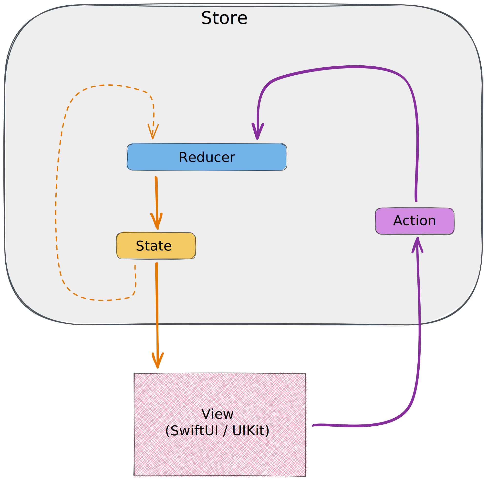
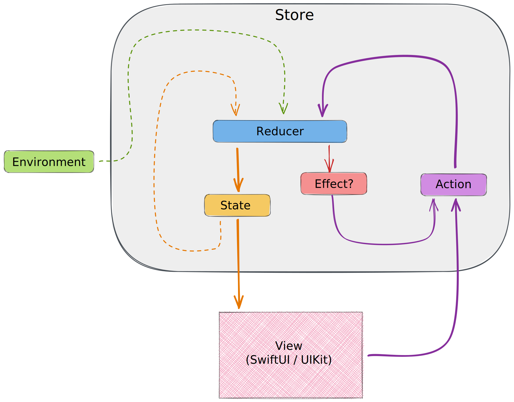

# TODO List SwiftUI + Swift Composable Architecture

## Requirements

- Xcode 12.5.1 or later
- Homebrew
- Mint: `brew install mint`

## Mint

- https://github.com/yonaskolb/Mint
- see `Mintfile`
- run `./scripts/format.sh`

## SwiftUI

- [Free SwiftUI Book](https://www.bigmountainstudio.com/free-swiftui-book)
- [Demystify SwiftUI](https://developer.apple.com/videos/play/wwdc2021/10022/)

## Swift Composable Architecture

- https://github.com/pointfreeco/swift-composable-architecture
- [Documentation](https://pointfreeco.github.io/swift-composable-architecture/)

### Simple Reducer

### Full Reducer

